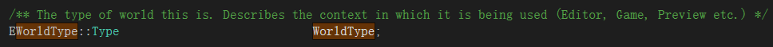
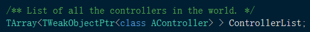
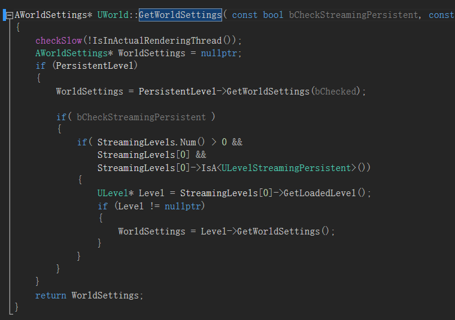
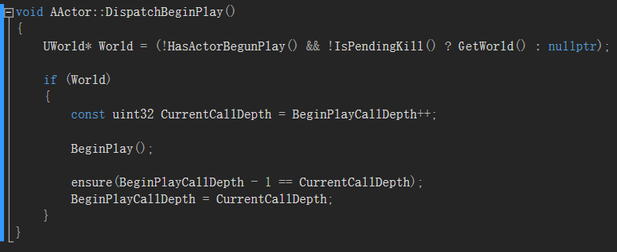
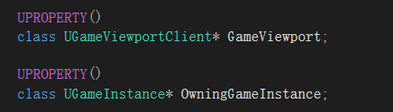

UWorld类：

World是代表地图或沙箱的顶级对象，Actors和Components 将存在并被渲染。

一个世界可以是一个单一的Persistent Level，其后可选地跟着一个存着 streaming
levels 的list，可以通过volumes and
blueprint功能加载和卸载，或者可以是由世界组织组成的层次集合。

在独立的游戏中，除了在目标和当前世界同时存在的无缝区域转换期间，通常只存在一个World。在编辑器中存在许多World：正在编辑的关卡，每个PIE实例，每个具有交互式渲染视口的编辑器工具等等。

ActiveGroupActors：

当前活跃的Actor数组

AudioDeviceHandle：

处理这个World的有源音频设备

AudioVolumes:

控制Volumes内部和外部的Audio效果的Tset

相关知识：[更多参考](https://docs.unrealengine.com/en-us/Engine/Actors/Volumes)

Volumes：它游戏中不可见，仿佛类似一个包围盒并有overlap的触发函数，但它是一个独立的Actor，可以直接放在Level中，而且不止是overlap的功能，它也可以acting
as a collision surface，从而阻止玩家进入Volumes。

它有很多子类

bAggressiveLOD:

加强LOD效果，当帧数低于DesiredFrameRate太多时

bBegunPlay：

是否Actor的BeginPlay()已经被调用

bDropDetail：

去除高细节的Actor，当帧数低于DesiredFrameRate太多时

bIsDefaultLevel：

是否默认的Level

bIsTearingDown：

World是否处于销毁状态

bPlayersOnly：

当世界tick时，只更新玩家，+Pending则延迟一帧后执行

Layers：

World中Actor引用的所有图层列表

bPostTickComponentUpdate：

表示在世界Tick期间，我们执行“脏“组件的最终组件更新（在PostAsyncWork和效果物理场景已运行之后）

MyParticleEventManager：

粒子事件管理器

NetworkManager：

网络管理器

PersistentLevel：

持久的Level：包含世界信息，默认画笔和在游戏过程中产生的Actor

一开始就加载进World

StreamingLevels：

后续动态加载进World，也可设置成alwaysloaded或者使用BP自定义加载时机

Levels：

World中所有的Level索引

TickGroup：

当前的Tick组

WorldType：

表示这个World的Type，比如Game,Editor

CurrentLevel：

编辑时指向当前的Level，游戏运行时= PersistentLevel

OwningGameInstance：

拥有这个World的游戏实例，是World的上层

各种的List

函数：

AddController():

添加Controller，实现是首先先在ControllerList上AddUnique，之后检查是否是一个PlayerContoller，是则继续在PlayerControllerList上AddUnique

AddLevel():

RemoveLevel():

这里定义了相关UWorld的FOnLevelsChangedEvent事件，每当Levels有变化就会广播这个事件（观察者模式）

AddPawn():

直接就在PawnList的AddUnique()

RemovePawn():

确认过这个Pawn的存在后，将与之互相绑定的ControllerUnpossess()，之后从PawnList中Remove，这么做的原因在于UWorld中有ControllerList，AddPawn()后便需要与Controller-\>Possess(),移除Pawn之后确保Controller没有错误的引用

BeginPlay():

开始游戏。这将导致Game Mode转换到正确的状态并在所有actor上调用BeginPlay

通过调用AGameModeBase和UAISystemBase的StartPlay()方法调用所有的Actor的BeginPlay

相关知识：[参考](https://docs.unrealengine.com/en-us/Gameplay/Framework/GameMode)

游戏的规则就是Game
Mode：比如这个Level最多的玩家数量，是否可以暂停游戏，玩家如何出场，重生等等

当游戏中的规则相关事件发生并需要跟踪并与所有玩家共享时，该信息将通过Game
State进行存储和同步：比如游戏是否已经开始，游戏运行了多久了

AGameModeBase：

注意GetWorldSettings()实际是属于Level的一个方法，即Level.WorldSetting，World的GetWorldSetting()实际上通常默认情况下调用了PersistentLevel-\>GetWorldSettings()
如下：

其中涉及的WorldSettings的方法：

注意：Actor是可以获得所属的World的Pointer的，核心的实现方法是通过UObject的方法：

GetOuter()，它可以获得上一层的指针，之后通过cast函数判断类名从而先获得Level的指针，之后通过Level-\>OwningWorld获得World的索引

UAISystemBase：

4.18.3这个版本的ue4似乎还没有完善这部分功能

CopyGameState():

设置这个World的GameMode和GameState，

CreateWorld():

大概的过程是首先创建一个World，并进行初始化，之后要进行NewWorld-\>AddToRoot()

Root集关系到UE4的GC（垃圾回收），简单地説，如果一个object不在Root集中，那么它将会被判定为回收对象，并在下一次GC时被释放，最后通知GEngine：GEngine-\>WorldAdded(
NewWorld )

DestroyWorld():

销毁当前World实例

关键的实现：这部分基本还是Create的逆操作

GetGameViewport():

可以看到GetGameViewport，是通过FWorldContext类实现的，而GEngine是最顶级的控制类的实例。官方的说明：

[FWorldContext](http://api.unrealengine.com/INT/API/Runtime/Engine/Engine/FWorldContext/index.html) A
context for dealing with UWorlds at the engine level. As the engine brings up
and destroys world, we need a way to keep straight what world belongs to what.

WorldContexts can be thought of as a track. By default we have 1 track that we
load and unload levels on. Adding a second context is adding a second track;
another track of progression for worlds to live on.

For the GameEngine, there will be one WorldContext until we decide to support
multiple simultaneous worlds. For the EditorEngine, there may be one
WorldContext for the EditorWorld and one for the PIE World.

[FWorldContext](http://api.unrealengine.com/INT/API/Runtime/Engine/Engine/FWorldContext/index.html) provides
both a way to manage 'the current PIE UWorld\*' as well as state that goes along
with connecting/travelling to new worlds.

[FWorldContext](http://api.unrealengine.com/INT/API/Runtime/Engine/Engine/FWorldContext/index.html) should
remain internal to
the [UEngine](http://api.unrealengine.com/INT/API/Runtime/Engine/Engine/UEngine/index.html) classes.
Outside code should not keep pointers or try to manage FWorldContexts directly.
Outside code can steal deal with UWorld\*, and pass UWorld\*s into Engine level
functions. The Engine code can look up the relevant context for a given
UWorld\*.

For
convenience, [FWorldContext](http://api.unrealengine.com/INT/API/Runtime/Engine/Engine/FWorldContext/index.html) can
maintain outside pointers to UWorld\*s. For example, PIE can tie UWorld\*
[UEditorEngine::PlayWorld](API\\Editor\\UnrealEd\\Editor\\UEditorEngine\\PlayWorld)
to the PIE world context. If the
PIE [UWorld](http://api.unrealengine.com/INT/API/Runtime/Engine/Engine/UWorld/index.html) changes,
the
[UEditorEngine::PlayWorld](API\\Editor\\UnrealEd\\Editor\\UEditorEngine\\PlayWorld)
pointer will be automatically updated. This is done
with [AddRef()](http://api.unrealengine.com/INT/API/Runtime/Engine/Engine/FWorldContext/AddRef/index.html) and [SetCurrentWorld()](http://api.unrealengine.com/INT/API/Runtime/Engine/Engine/FWorldContext/SetCurrentWorld/index.html) .

总的来说：一个FWorldContext针对一个UWorld，并且它被保存在UEngine的类中（TIndirectArray\<FWorldContext\>
WorldList）UEngine和FWorldContext的更加直观关联是通过UGameInstance，一个UEngine的子类（UGameEngine或是UEditorEngine）拥有一个UGameInstance的索引，而UGameInstance又有FWorldContext。

（UGameEngine类中）

FWorldContext的重要的成员：

UEngine中：

这个是全局的：GEngine

InitializeActorsForPlay():

初始化所有Actor并准备开始游戏，实现较为复杂

InitializeNewWorld():

由新创建的世界自身调用，初始化自己，即是在CreateWorld()中已经被NewWorld调用

InitializationValues:一个World必要的初始化参数struct

InitWorld():

初始化World，主要根据InitializationValues设置相关的参数或是调用方法启动相关功能，以及一些关联，比如设置初始化标记位，设置PersistentLevel的所属World，确保PersistentLevel的WorldSettings（通过UWorld::RepairWorldSettings()）（注意：一个World没有一个直接的WorldSettings的索引，而GetWorldSettings()函数是默认通过PersistentLevel的GetWorldSettings实现），广播Level
Changed(通过BroadcastLevelsChanged)等等

RepairWorldSettings():

主要功能是修复PersistentLevel的AWorldSettings，顺利的话只需把PersistentLevel-\>Actors[0]转化(cast为AWorldSettings)并赋值即可。

相关知识：ULevel中有一个各为SortActorList()的函数：

部分实现如下：

也就是一般情况下，WorldSettings是Actors的0索引处

RunTickGroup():

运行一个Tick group，tick这个group的所有Actor和组件

SpawnActor():

产生一个Actor，拥有多个重载，实现复杂

ULevel：

包含关卡的Actor List，BSP信息和Bursh
List。每个Level都有一个World作为其Outer，并且可以用作PersistentLevel，然而，当一个级别已经在OwningWorld中流动时代表了它所属的世界。A
Level是Actors（lights, volumes, mesh instances
etc.）的集合。多个Level可以加载并卸载到世界中以创建流式传输体验。

URL：这个Level的资源标识地址。

Actors：这个Level所有的Actors List

相关知识：

FURL：类似一个地址，但还有更多其他信息

OwningWorld：这个Level所属的World

AssetUserData：与资产一起存储的用户数据阵列

LevelScriptActor：

关卡的脚本

相关知识：

BSP 画刷是虚幻关卡中最基本的构建块。从理论上说，最好将 BSP
想象为可以在关卡中进行雕塑并填充空间体积的东西。BSP
曾经备用作为关卡设计中最主要的构建块，但是现在我么已经引入了更加高效的并且具有不同专门用途的几何体类型。然而，BSP
在产品的初期阶段用于构建关卡和物体原型时仍然是非常有用的

方法：

ApplyWorldOffset():

按指定偏移量移动Level中的Actor

BroadcastLevelBoundsActorUpdated():

广播Level内的Actor已更新

GetWorld():

Return OwningWorld

GetWorldSettings():

返回WorldSettings

Initialize():

初始化ULevel，实现是URL的赋值

SortActorList():

实现的思路：首先尝试将WorldSettings放到Actors的0索引处，紧接着调用World的AddNetWorkActor()将WorldSettings添加到NetDriver上，最后直接先添加非Net的Actor，最后Append上相关网络的Actor

ULocalPlayer：

每个在当前客户端上活动的玩家都有一个LocalPlayer类

继承于UPlayer：

PlayerController：这个Player受控制的PlayerController

Exec()：

调用World-\>Exec并且进行了其他许多操作

SwitchController():

转换UPlayer的PlayerController

ULocalPlayer中：

Origin,Size,LastViewLocation:

都是相关相机的位置信息，分别是视口左上角相对主窗口的坐标，视口大小，上一帧View的坐标

ViewportClient:

\* A game viewport (FViewport) is a high-level abstract interface for the

\* platform specific rendering, audio, and input subsystems.

\* GameViewportClient is the engine's interface to a game viewport.

\* Exactly one GameViewportClient is created for each instance of the game. The

\* only case (so far) where you might have a single instance of Engine, but

\* multiple instances of the game (and thus multiple GameViewportClients) is
when

\* you have more than one PIE window running.

相当于View的最高管理者

CalcSceneViewInitOptions():

计算这个View Actor的绘制视图初始化设置

CalcSceneView():

计算这个View Actor的绘制视图设置

GetGameInstance():

通过ViewportClient获得GameInstance

SpawnPlayActor():

生成一个ControllerActor，实际是调用了World-\>SpawnPlayActor()
