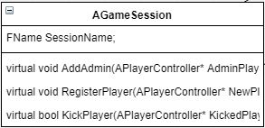
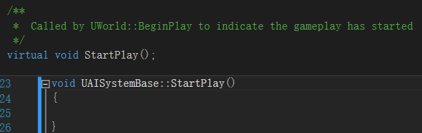

**AGameModeBase：**

GameModeBase定义正在玩的游戏。它管理着游戏规则，得分，在这种游戏类型中允许哪些演员存在，以及谁可以进入游戏。

它只在服务器上实例化，并不会在客户端上存在。

在C ++ *UGameEngine :: LoadMap（）中*为游戏玩法初始化关卡时，GameModeBase
actor被实例化 。

此GameMode actor的类由（按顺序）URL？game = xxx，并在World
Settings中设置的GameMode Override值或游戏的Project
Settings中设置的DefaultGameMode条目确定。

这个类的主要内容即是管理游戏规则，defalut玩家Pawn的管理，玩家加入游戏的行为和初始化（HUD）。与GameSession不同，GameModeBase是上层的规则，它没有具体到Player的操作，GameSession则是一个具体的一次会话实例

方法：

InitNewPlayer():

1.  在session上注册player

GameSession-\>RegisterPlayer(NewPlayerController, UniqueId.GetUniqueNetId(),
UGameplayStatics::HasOption(Options, TEXT("bIsFromInvite")));

1.  Find a starting spot，找到起始点

2.  Set up spectating，设置观战（如果是观众）

>   NewPlayerController-\>StartSpectatingOnly();

1.  Init player's name

>   NewPlayerController-\>PlayerState-\>SetPlayerName();

InitGame():

通过World创建了GameSession，这里说明一点：UWorld：：SpawnActor在Create新Actor后会将其纳入指定的Ulevel之下(根据SpawnParameters参数，默认在CurrentLevel)

AActor\* const Actor = NewObject\<AActor\>(LevelToSpawnIn, Class, NewActorName,
SpawnParameters.ObjectFlags, Template);

LevelToSpawnIn-\>Actors.Add( Actor );

LevelToSpawnIn-\>ActorsForGC.Add(Actor);

而且SpawnActor只在World中，而不在level中，更不在Actor中，原因是Actor是存在一个Outer的这里一般是Level（大概也能是一个Component），Level中有Actor的直接索引，World则是通过Levels的遍历访问Actor的，因此New
Actor不必在World中注册

InitGameState():

初始化GameState

**AGameSession**

充当游戏特定的会话界面封装。当需要与会话界面交互时，游戏代码会对此进行调用。在运行在线游戏时，游戏会话仅存在于服务器中。

更像是一个游戏房间，内有Kick，Register Players方法。

本身并不存储Player的信息，只是负责分配自身（房间）的信息到具体的PlayerState。

RegisterPlayer():

总之仍是设置NewPlayer-\>PlayerState。

Login():

创建一个PlayerController并返回

主要是通过

GameSession-\>ApproveLogin(Options);

APlayerController\* NewPlayerController = SpawnPlayerController(InRemoteRole,
FVector::ZeroVector, FRotator::ZeroRotator);

Logout():

注销指定的Controller，可以看出GameModeBase并不存储直接的PC索引，而是由GameSession直接管理的

**APlayerState**

PlayerState是为服务器上的每个玩家（或在独立游戏中）创建的。玩家状态被复制到所有客户端，并且包含关于玩家的网络游戏相关信息，例如玩家名称，分数等。

RegisterPlayerWithSession():

通过FName SessionName;

向该Session注册这个PlayerState，使用了UOnlineEngineInterface【空函数】

这样的话，也就是GameSession中的Register没有实际的行动(目前)

**UOnlineEngineInterface**

引擎和OnlineSubsystem之间的接口类，用于消除两者之间的依赖关系，真正的工作是在OnlineSubsystemUtils的UOnlineEngineInterfaceImpl中实现的，期望是这个基本的函数组不会扩展/更改，并且OnlineSubsystem可以独立于引擎。

游戏不应该使用这个接口，直接使用OnlineSubsystem插件

Player的注册/注销实现为空

**UAISystemBase**

目前也是一个象征性的类，关键函数为空，是World的一个成员

StartPlay():

InitializeActorsForPlay():

**UGameInstance**

GameInstance：运行游戏实例的高级管理器对象。在游戏创建时产生，并且在游戏实例关闭之前不会被销毁。作为独立游戏运行，只有一个。在PIE（玩在编辑器）中运行将为每个PIE实例生成其中的一个。

和UEngine区别在于它不保存相关引擎的配置，但它可以Get
Engine来配置系统，它在乎的是游戏进行的动态数据：当前的进行游戏的LocalPlayer等等

注意：UonlineSession类基本无实际作用，而它的子类中UOnlineSessionClient可能有较好的实现，但它已经归属API/Plugin，所以猜测Engine模块下的Session，UOnlineEngineInterface等目前没有用，只是象征地放在那里，实际相关网络会话的操作不在Engine模块，更多的可能在插件中实现了

AddLocalPlayer():

添加一个LocalPlayer，同时给予Controller

StartGameInstance():

启动游戏实例的状态机，实现进行了创建初始URL，等待一个网络连接进入Starting
Level，最后调用了Onstart()

**UGameEngine**

管理启用游戏的核心系统的引擎。

CreateGameWindow()：

CreateGameViewport()：

GetGameSceneViewport():

**UEngine**

保存游戏的全局设置或相应管理器的索引，例如：最低期望的帧速率，呈现LOD着色的颜色，音频设备处理主音频设备，网格的细节范围控制级别（LOD），粒子事件管理器。

最接近游戏引擎的底层

方法：

UEngine :: LoadMap（）:

这个方法的主要目的是”更换”World，加载新的地图

大概的流程是：

首先准备阶段，基本用宏来调用函数

确保当前World的StreamingLevel状态没有冻结，之后会回收当前的World

广播信息，这里使用PreLoadMap来广播，URL.Map是参数FURL中的Map信息（FString类型）

这里清理packages(这里的package是根据加载时机定义的Object的所属集),调用了UEngine::
CleanupPackagesToFullyLoad()

可以看到这个实现是遍历Context的所有的FFullyLoadedPackagesInfo

（内部有TArray\<class UObject\*\> LoadedObjects;列举了已经加载的object）

如果符合name将LoadedObjects全部移出Root（之后进入Pendingkill状态等待下一次GC）

然后是关于异步加载map的问题（省略）

开始unload当前World

如果URL中的有quiet的指令，则会配置UEngine：：TransitionGameMode作为过渡的GameMode信息，

之后开始具体的unload操作：

首先关闭网络：ShutdownWorldNetDriver(WorldContext.World());

广播level从World中移除的消息；

断开players和World中PlayerControllers的连接；

结束World中Actor的状态，调用了AActor:: RouteEndPlay【参数是Reason
Type如果Actor已经初始化则先调用AActor::EndPlay(Reason)=\>如果HasBegunPlay，则调用ReceiveEndPlay()=\>用户自定义的End操作，并取消自己以及Component的开始Play状态】【最后取消Actor上的Component的初始化】

之后cleanupWorld()

GEngine（全局实例）的进行这个World相关的信息的更改，并将World移出Root

之后进行World的可能被包含的相关的类进入PendingKill状态

CastChecked\<UWorld\>(Level-\>GetOuter())-\>MarkObjectsPendingKill();

CastChecked\<UWorld\>(LevelStreaming-\>GetLoadedLevel()-\>GetOuter())-\>MarkObjectsPendingKill();

AudioDevice-\>Flush(WorldContext.World());

AudioDevice-\>SetTransientMasterVolume(1.0f);

最后

WorldContext.SetCurrentWorld(nullptr);

后进到这里Unload World的操作结束。

开始创建新的World

这里对于PIE（Play In Editor）有额外的操作，

之后进行Map load

主要的实现：

省略一波操作之后来到

配置NewWorld的参数以及相关的，GWorld立场与GEngine有点相似

之后就是World的一些基本的初始化

……

……

之后是相关其他的操作

**UActorComponent**

ActorComponent是定义可重用行为的组件的基类，可以将其添加到不同类型的Actor中。具有变换（坐标）的ActorComponent被称为SceneComponents，可以被渲染的是PrimitiveComponents。

AssetUserData：组件用到的用户数据

PrimaryComponentTick，相关tick行为，Component也是可以tick的

BeginPlay():

在Level层被调用，应该发生在这个Component的父Actor或Component的BeginPlay（）之后，在BeginPlay之前必须先registered
和 initialized

Activate():

激活Component，开启Tick

RegisterComponentTickFunctions():

注册Tick函数

TickComponent():

实际上被PrimaryComponentTick的ExecuteTick调用，其实现是通过World管理：World先
GetLatentActionManager，如果有OwningGameInstance返回GameInstance的LatentActionManager，否则返回自己的，之后调用它的ProcessLatenAction。【LatentActionManager】大概就是真正管理渲染Tick的类，类中有TSet\<UObject\*\>
ProcessedThisFrame;是用来存我们已经处理了这个框架的潜在动作列表的对象列表，另外还有BeginFrame
()，其作用就是reset这个Set

RegisterComponent():

注册Component，实际调用了RegisterComponentWithWorld，其中进行了很多操作：根据状态可能包括注册TickFunc，初始化Component，BeginPlay()，

void UActorComponent::DestroyComponent(bool bPromoteChildren/\*= false\*/)

{

// Avoid re-entrancy

if (bIsBeingDestroyed)

{

return;

}

bIsBeingDestroyed = true;

if (bHasBegunPlay)

{

EndPlay(EEndPlayReason::Destroyed);

}

// Ensure that we call UninitializeComponent before we destroy this component

if (bHasBeenInitialized)

{

UninitializeComponent();

}

// Unregister if registered

if(IsRegistered())

{

UnregisterComponent();

}

// Then remove from Components array, if we have an Actor

if(AActor\* MyOwner = GetOwner())

{

if (IsCreatedByConstructionScript())

{

MyOwner-\>BlueprintCreatedComponents.Remove(this);

}

else

{

MyOwner-\>RemoveInstanceComponent(this);

}

MyOwner-\>RemoveOwnedComponent(this);

if (MyOwner-\>GetRootComponent() == this)

{

MyOwner-\>SetRootComponent(NULL);

}

}

// Tell the component it is being destroyed

OnComponentDestroyed(false);

// Finally mark pending kill, to NULL out any other refs

MarkPendingKill();

}

通过这个函数比较能清晰一个组件的流程

组件先Register之后，进行初始化，开始Play。

组件可能属于Actor，Actor也可能属于组件，同时解除他们之间的索引

当这个组件被销毁后，正巧它是一个Actor的RootComponent(类型是SceneComponent拥有坐标转换)，那么SetRootComponent=NULL

**USceneComponent**

包围体

AttachToComponent():

将此SceneComponent
Attach到别的SceneComponent上，注意：只有SceneComponent以及子类可以相互嵌套，ActorComponent不可，它只能attach到Actor上，或者被Actor
attach。

实现复杂：涉及到Transform和OwnerActor的问题
