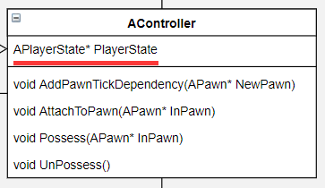
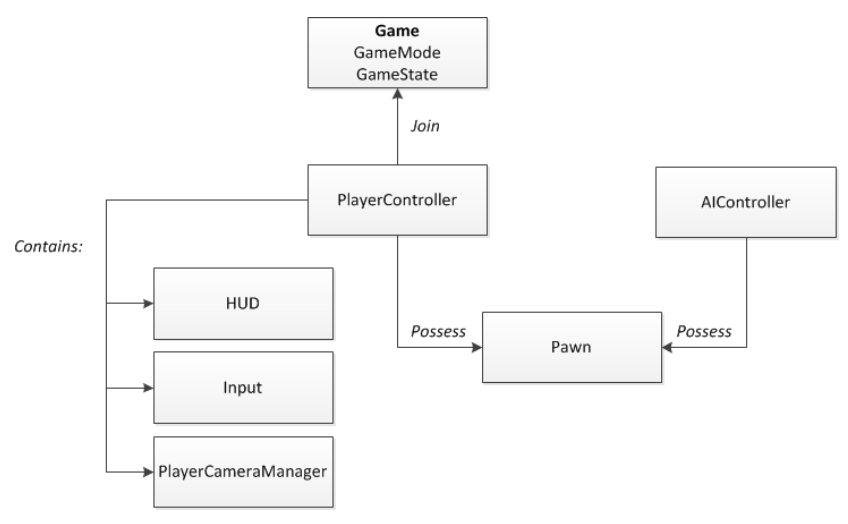

**虚幻4的Engine模块**

**Gameplay框架：**

Actor是一个游戏玩法实体，通常包含一个或多个Component，在游戏过程中可以静态地放置在Level中或通过Spawned动态生成，并支持多人游戏的网络复制。所有的Actor都从AActor类延伸出来，这个类是可重构游戏对象的基类。

需要注意的是，AActor有一个子类AInfo（不进行渲染而只进行信息的存储），之所以继承于Actor的原因大概是想利用Actor已经实现好的各种基本功能，尤其是网络复制，尽管AInfo不进行渲染，但很多也需要进行网络同步的

从某种意义上讲，Actor可以被认为是容纳特殊类型对象（称为组件）的容器。例如，一个CameraActor包含一个CameraComponent。但是这不是绝对的，功能也能通过自己的Actor对象的代码实现，但这明显不是一个最好的解决方法，因为要考虑重用性的问题，这样，各种各样的功能组件可以被用在各种的Actor上，如下图将CameraComponent附加到Pawn上

Pawn类那些可以由玩家或AI控制的所有Actor的是基础类（也继承于Actor）。Pawn是World范围内玩家或AI实体的物理表征。这不仅意味着Pawn决定了玩家或AI实体在视觉上的外观，还意味着它在碰撞和其他物理交互方面与世界的交互方式。Pawn代表游戏中玩家或实体的物理位置，旋转等。一个Character是一种特殊类型的Pawn，它有人型的走动，动画等功能。

它们之间的使用差别：如果游戏的主角们是各种各样的球体的，而玩家只能控制球体的滚动，这个时候只需使用Pawn就行，但如果游戏是一个写实的风格，需要一个人形的角色，直接使用Character会很省事，它已经集成了很多人形角色的功能和组件。

以下是官方的区别解释：

默认情况下，Controller和Pawns
之间有一对一的关系，即每个控制器在任何给定时间只控制一个Pawn，但是也能设置为一对多。此外，游戏过程中Spawned的Pawn不会被Controller自动Possess，需要自己增加逻辑调用Controller的Possess函数。

主要有两种子Controller：

PlayerController和AIController

PlayerController是由玩家进行控制的，AIController则是电脑计算的控制器

以下是Controller的官方描述

为了网络游戏中其它Player信息的传递，还有一个Info类：**Player State**

PlayerState是为服务器上的每个玩家（或在独立游戏中）创建的。玩家状态被复制到所有客户端，并且包含关于玩家的网络游戏相关信息，例如玩家名称，分数等。

如下图所示的那样：PlayerState是被Controller所包含的，但是需要注意：一般AIController是没有自己可用的PlayerState的。

以上就是Pawn，Controller和PlayerState之间的联系

以下是PlayerState的官方解释：

接下来是游戏模式和游戏状态的类，顺带提及GameSession

有两个主要类处理关于正在玩的游戏的信息：Game Mode和Game State

即使是最开放的游戏也有规则的基础，这些规则组成了**Game
Mode**（只在服务器上，一般只存放不变的量）。在最基本的层面上，这些规则包括：

-   参加游戏的Player和观众的数量，以及Player和观众的最大数量。

-   玩家如何进入游戏，其中可能包括用于选择spawn位置和其他spawn/respawn行为的规则。

-   是否可以暂停游戏，以及如何暂停游戏。

-   关卡之间的转换，包括游戏是否应以电影模式开始。

总的来说GameModeBase定义正在玩的游戏。它管理着游戏规则，得分，在这种游戏类型中允许哪些演员存在，以及谁可以进入游戏。

它只在服务器上实例化，并不会在客户端上存在。

在C ++ UGameEngine :: LoadMap（）中为游戏玩法初始化关卡时，GameModeBase
actor被实例化 。

此GameMode actor的类由在World Settings中设置的GameMode Override值或游戏的Project
Settings中设置的DefaultGameMode条目确定。

这个类的主要内容即是管理游戏规则，defalut玩家Pawn的管理，玩家加入游戏的行为和初始化（HUD）。与GameSession不同，GameModeBase是上层的规则，它没有具体到Player的操作，GameSession则是一个具体的一次会话实例

比如：它的InitNewPlayer():

1.在session上注册player

>   GameSession-\>RegisterPlayer(NewPlayerController, UniqueId.GetUniqueNetId(),
>   UGameplayStatics::HasOption(Options, TEXT(“bIsFromInvite”)));

2.Find a starting spot，找到起始点

3.Set up spectating，设置观战（如果是观众）

NewPlayerController-\>StartSpectatingOnly();

4.Init player’s name

NewPlayerController-\>PlayerState-\>SetPlayerName();

GameSession的话则是在GameMode:: InitGame()中通过UWorld：：SpawnActor创建的。

充当游戏特定的会话界面封装。当需要与会话界面交互时，游戏代码会对此进行调用。在运行在线游戏时，游戏会话仅存在于服务器中。

更像是一个游戏房间，内有Kick，Register Players方法。

本身并不存储Player的信息，只是负责分配自身（房间）的信息到具体的PlayerState。

当游戏中的规则相关事件发生并需要跟踪并与所有玩家共享时，该信息将通过**Game
State**（存在于服务器和所有客户端上，并且可以自由复制以保持所有机器处于最新状态）进行存储和同步。这些信息包括：

-   游戏运行了多久（包括本地玩家加入之前的运行时间）。

-   当每个Player加入游戏时，以及该Player的当前状态。

-   当前Game Mode的基类。

-   游戏是否已经开始。

以下是官方的说明：

HUD

User Interfaces（UI）和Heads-up
Displays（HUD）是游戏向玩家提供关于游戏信息的方式，并且在某些情况下允许玩家与游戏交互。

虚幻4提供了多种创建UI和HUD的方法。Canvas类可以用来直接在画在低层次显示在屏幕上，并覆盖到世界上。

HUD指游戏过程中屏幕上的状态和信息。HUD的目的是告知玩家当前的比赛状态，即比分，他们的健康状况，剩余时间等。HUD通常是非交互式的，这意味着玩家不点击HUD。

UI指的是菜单和其他交互元素。这些元素通常被绘制得像HUD一样重叠在屏幕上，但在某些情况下，它们可能是游戏世界本身渲染到世界表面的一部分。UI最常见的例子是当游戏启动时显示的主菜单或当玩家暂停游戏时显示的暂停菜单。但是，其他UI可能在Play过程中显示。这些可以用来在游戏中的角色或更复杂的情况下（例如RTS或RPG中）显示角色之间的对话，它们可以是玩游戏本身的组成部分，允许玩家选择武器，装甲，建造单位等。

游戏中每个玩家都有自己的HUD实例，用来绘制他们自己的Viewport，即使是多人分屏游戏也是如此，HUD的类型是由游戏类型决定的

Canvas是可以在HUD的渲染循环中使用的一个对象，以便在屏幕上绘制文本，纹理和材质切片，任意三角形和简单基本形状等元素。一般使用Canvas绘制创建HUD和UI。

虚幻也有自己的UI绘制系统，目前有两个（Slate UI和UMG
UI）后者是由前者通过蓝图扩展而来的，虽然功能有局限，但使用更加容易方便

Camera代表玩家在视图中的点;以及玩家如何看待这个世界。因此，Camera只与人类控制的玩家（Pawn）有关。因此PlayerController指定了一个Camera类并实例化一个Camera
Actor是用来计算玩家从看世界的位置和方向

所有相机的属性和行为都在CameraComponent中设置;
CameraActor类主要充当CameraComponent的包装，使得相机可以放在level中，因为只有Actor才能被放在level中。

在CameraComponent中，可以设置相机是处于透视模式还是正交模式

PlayerControllers和Actor含有CalcCamera函数。Actor的CalcCamera函数返回Actor中第一个CameraComponent的相机视图，如果bFindCameraComponentWhenViewTarget为true并且存在CameraComponent。

否则，它会获得Actor的位置和旋转。在PlayerController中，CalcCamera函数的行为类似于第二种情况，返回拥有Pawn的位置（如果存在）以及PlayerController的控制旋转

相机责任链（Camera Responsibility Chain）

责任链是从顶层传递到底层的：

CameraComponent-\>Actor or PlayerController-\>PlayerCameraManager
最后rendering，显示给本地玩家

ViewTarget结构体, 在PlayerCameraManager中被定义, 负责提供给 PlayerCameraManager
理想的 Point of View
(POV)，ViewTarget包含关于目标Actor信息，目标Actor的Controller（用于非本地地控制Pawn），以及PlayerState（用于在观战时通过Pawn
transitions and other changes跟随同一个Player）

POV属性传递给PlayerCameraManager的相机信息的格式为aFMinimalViewInfo结构。该结构包含来自CameraComponent的基本相机信息，包括位置，旋转，投影模式（透视或正交），FOV，正交宽度，高宽比和后期处理效果。

通过向PlayerCameraManager提供对这些值的访问权限，PlayerCameraManager可以在摄像机管理期间在两种摄像机模式之间进行混合。

ViewTarget根据我的理解就是：从｛\$ViewTarget｝中相机组件提取视图等信息的对象。

如果一个ViewTarget是CameraActor或是一个包含CameraComponent的Actor并且它设置bFindCameraComponentWhenViewTarget
标记为true，那么CameraComponent将能提供有关相机的属性信息。

Pawn可以设置属性bTakeCameraControlWhenPossessedPawn为true，这样一旦有PlayerController
Possess了这个Pawn，则它会会自动成为ViewTarget。

PlayerCameraManager类是一个相机管理器。默认情况下，其自身的内置行为是在控制台命令触发的待定视图目标和调试摄像机之间进行混合。否则，它将查询ViewTarget的相机视点以及所有其他相机设置

以上就是Gameplay的框架简述

引用了官方的关系图：

另外，PlayerController还保存了与之相关联的UPlayer对象的索引，还要注意只有PlayerController才有HUD，Input，PlayerCameraManager这些，AIController无需这些。

**游戏的流程（这里只讨论独立的游戏，而不是UE编辑器中）：**

开启后首先初始化UGameEngine，之后从中创建UGameInstance，之后UGameInstance进行初始化，然后创建网络会话并注册代理（比如开发者自定义的重叠动作函数，Actor初始化等），接着就是调用UGameEngine的start函数，接下来就是靠近顶层的调用了，UWorld调用BeginPlay(),其实现是依次调用Actor和相关Component的BeginPlay()，这些BeginPlay都会依赖Engine的底层实现，之后调用AGameMode的startplay()，往后开启比赛，动态产生Actors……

**UGameEngine**:继承于**UEngine**

是管理启用游戏的核心系统的引擎。保存游戏的全局设置或相应管理器的索引，例如：最低期望的帧速率，呈现LOD着色的颜色，音频设备处理主音频设备，网格的细节范围控制级别（LOD），粒子事件管理器。

核心的方法有UEngine :: LoadMap() [主要目的是”更换”World，加载新的地图]

**UGameInstance:**

运行游戏实例的高级管理器对象。在游戏创建时产生，并且在游戏实例关闭之前不会被销毁。作为独立游戏运行，只有一个。在PIE（玩在编辑器）中运行将为每个PIE实例生成其中的一个。

和UEngine区别在于它不保存相关引擎的配置，但它可以Get
Engine来配置系统，它在乎的是游戏进行的动态数据：当前的进行游戏的LocalPlayer等等

这里顺便一提：**ULocalPlayer（**继承于**UPlayer）**

ULocalPlayer有一个与之相关联的PlayerController的索引，之前在说PlayerController也有提到，之所以在这里说ULocalPlayer，是因为UGameInstance保存了ULocalPlayer的索引，并且ULocalPlayer是由UGameInstance创建的，通过ULocalPlayer来对本地玩家进行管理和操作，同时ULocalPlayer还集成了Viewport的相关功能，因为PlayerController本身也是含有CameraComponent，HUD的，与之相对的，UPlayer还有一个子类UNetConnection是相关网络玩家的，这里不去讨论

**UWorld:**

World是代表地图的顶级对象（拥有这个world中的所有level索引），所有的Actors和Components
将存在于world中（注意不是全部是直接索引的，可以是通过Level间接索引）并被渲染（可以被渲染的话）。

一个世界可以是一个单一的Persistent
Level（一开始就加载进World），其后可选地跟着一个存着 streaming levels
的list，可以通过volumes and
blueprint功能动态加载和卸载，或者可以是由世界组织组成的层次集合。

在独立的游戏中，除了在目标和当前世界同时存在的无缝区域转换期间，通常只存在一个World。在编辑器中存在许多World：正在编辑的关卡，每个PIE实例，每个具有交互式渲染视口的编辑器工具等等。

World中也存在部分的Manager:比如网络，粒子事件管理器

**FWorldContext:(UWorld的补充)**

这个结构体很简单，但它是游戏实例与World的连接结构

一个FWorldContext针对一个UWorld，并且它被保存在UEngine的类中（TIndirectArray\<FWorldContext\>
WorldList），UEngine和FWorldContext的更加直观关联是通过UGameInstance，一个UEngine的子类（UGameEngine或是UEditorEngine）拥有一个UGameInstance的索引，而UGameInstance又有FWorldContext。

**Ulevel:**

包含关卡的Actor List，BSP信息和Bursh
List。每个Level都有一个World作为其Outer，并且可以用作Persistent
Level，然而，当一个level的OwningWorld代表了它所属的世界。A
Level是Actors（lights, volumes, mesh instances
etc.）的集合。多个Level可以以流式加载并卸载到世界中

BSP 画刷是虚幻关卡中最基本的构建块。从理论上说，最好将 BSP
想象为可以在关卡中进行雕塑并填充空间体积的东西。BSP
曾经备用作为关卡设计中最主要的构建块，但是现在引入了更加高效的并且具有不同专门用途的几何体类型。然而，BSP
在产品的初期阶段用于构建关卡和物体原型时仍然是非常有用的

注意这里有两个概念：**LevelScriptActor和WorldSetting**

**LevelScriptActor**：官方说明：ALevelScriptActor is the base class for classes
generated by ULevelScriptBlueprints. ALevelScriptActor instances are hidden
actors that exist within a level, and can execute level-wide logic (operating on
specific actor instances within the level). The level-script’s functionality is
defined inside the ULevelScriptBlueprint itself (using the blueprint’s
node-based interface).

可以看出LevelScripActor是一个脚本，由关卡蓝图产生，用来驱动Level的不可见Actor

**WorldSettings**：官方说明：Actor containing all script accessible world
properties.

正如以下显示的，WorldSettings是设置的一系列World参数配置（并且有GameMode），但需要注意它也是保存在Level里的，而World中也是从Level中获取并保存加载的。

WorldSettings一般会被放到ULevel的 Actors
List的0索引处，紧接着先添加非Net的Actor，最后Append上相关网络的Actor，这些操作由ULevel::
SortActorList()实现

**AActor:**

Actor是可以在关卡中放置或产生的Object的基类。
Actor可能包含一系列ActorComponents，它们可以用来控制actor如何移动，如何渲染等等。Actor的另一个主要功能是在播放过程中通过网络复制属性和函数调用。

它必须（如果需要显示在level中）有一个RootCompoent（继承于SceneConponent）使用RootCompoent的变换（坐标）作为Actor的变换（坐标）

**UActorComponent:**

ActorComponent是定义可重用行为的组件的基类，可以将其添加到不同类型的Actor中。具有变换（坐标）的ActorComponent被称为SceneComponents，可以被渲染的是PrimitiveComponents。

就像之前就已经提到过的CameraComponent，组件就是丰富功能的可重用的模块，UE4已有有很多的Component了，这里不一一研究

**USceneComponents:**

直接继承于UActorComponent，最主要的细化有：

1.增加了Transform

2.增加了包围体

3.增加了函数AttatchToComponent()，用于USceneComponents之间相互嵌套

顺便一提：

1. Actor \<—可归属于— Component [通过USceneComponents::
AttatchToComponent()](注意，这里的操作是不是Actor本身，而是Actor的RootCompoent)

2. Actor \<—可归属于— Component
[通过AActor::AddOwnedComponent()](这里是Actor本身)

3. Component \<—可归属于— Actor [通过Actor::
AttachToComponent()](注意，这里的操作是不是Actor本身，而是Actor的RootCompoent)

4. Component \<—可归属于— Component [通过USceneComponents::
AttatchToComponent()]

5. Actor \<—可归属于— Actor [通过UChildActorComponent实现]

最后提一下Tick函数:

**FTickFunction:**

这是一个TickFunction基本结构体，有两个子结构体，分别是

FActorTickFunction和FActorComponentTickFunction，它们直接分别在Actor和Component中有相应的直接索引。

Tick有不同的Tick Group，用来在不同状态下Tick对应的Tick 组的Tick函数

Tick也可以有依赖项，通过AddPrerequisite能够设置Tick在某Tick之后才进行

**FTickTaskLevel:**

这是一个TickFunctions的集合（类似Level的存在），而它也是被Ulevel直接索引的

FTickFunction可以通过(FTickFunction::RegisterTickFunction()注册自己到FTickTaskLevel上)

**FTickTaskManager:**

FTickTaskManager则是更高级的管理者（类似World的存在），注意它是一个单例，它有FTickTaskLevel的索引列表，通过它来管理全部的Tick函数

当然游戏少不了资源：

虚幻的项目包含资产，作为.uasset文件存储在“内容”文件夹中。这些资产可以包括材料，静态和骨架网格，蓝图，声音提示和纹理，并且是可重复使用的参考材料和模板，可以由项目中的对象调用。

项目也包含level，level也经常被称为地图，并作为.umap文件存储在内容文件夹中。在虚幻编辑器中，一次只能处理一个level，并且level显示在视口中。
